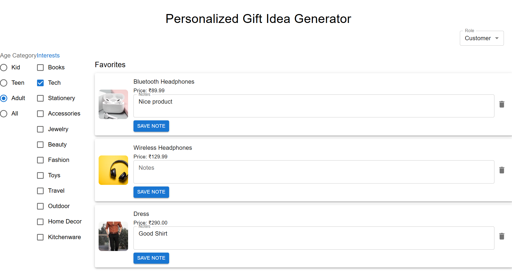

# Personalized Gift Idea Generator

This is a React-based web application that helps users find personalized gift ideas. The app supports role-based access control, allowing admin users to add and update gifts, while customers can only view gifts and manage their favorites.

## Features

- Browse a list of gift ideas filtered by age group, category and budget.
- Admin users can add new gifts through a dedicated form.
- Customers can add gifts to their favorites list. 
- Role-based UI rendering: 
  - Admins can add gifts.
  - Customers can view gifts and manage favorites.
- Local storage persistence for gifts and favorites to maintain state across sessions.

## Project Structure

- `src/`
  - `components/` - React components including GiftList, AddGiftForm, FavoriteList, RecipientForm, etc.
  - `slices/` - Redux slices for gifts, favorites, filters and user role management.
  - `store/` - Redux store configuration.
  - `App.js` - Main app component with role-based conditional rendering.
- `public/`
  - `gift.json` - Initial gift data loaded on app start.

## Installation

1. Clone the repository:
   ```
   git clone <repository-url>
   cd personalized-gift-idea-generator
   ```

2. Install dependencies:
   ```
   npm install
   ```

3. Additional installed packages:
   - `@reduxjs/toolkit`
   - `react-redux`
   - `@mui/material`
   - `react-beautiful-dnd`
   - `@mui/icons-material`

4. Start the development server:
   ```
   npm start
   ```

5. Open your browser and navigate to `http://localhost:3000`.

## Usage

- Customers can browse gifts and manage favorites.
- To add gifts, the user role must be set to "admin". 
- The Add Gift form is only visible to admin users.
- The Favorites list is only visible to customers.

## Testing

- Verify that the Add Gift form is only accessible to admin users.
- Verify that customers cannot see or use the Add Gift form.
- Verify that the Favorites list is only visible to customers.


## Screenshots
- Favorites Management 

- Admin Gift Creation 


- Added Gift


- Smart Filtering  


